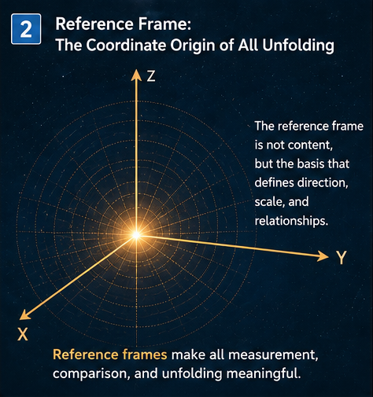
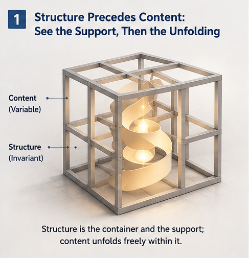

# FIGURE INDEX

## Visual Guide for General Structure Unfolding Intelligence

**GSUI — General Structure Unfolding Intelligence**

---

## Purpose

This document provides the canonical navigation and placement guide for the initial GSUI figure set.

The figures are intended to support three reading levels:

```text
Repository Level
→ overall paradigm

Paper Level
→ specific structural concepts

Concept Level
→ individual GSUI mechanisms
```

The visual sequence follows the conceptual development:

```text
Structure
   ↓
Reference Frame
   ↓
Core / Variable Relation
   ↓
Structural Hierarchy
   ↓
Self-Relative Unfolding
   ↓
Persistent Structural Self
```

The figures should complement the text rather than replace formal definitions.

---

# 1. Figure Overview

| Figure  | Main Theme                               | Primary Paper                | Primary Function                  |
| ------- | ---------------------------------------- | ---------------------------- | --------------------------------- |
| Fig-000 | Structure Precedes Content               | README / GSUI-001            | Repository-level conceptual entry |
| Fig-001 | Reference Frame of Unfolding             | GSUI-002 / GSUI-005          | Explain Delta relativity          |
| Fig-002 | Stable Structure and Variable Content    | GSUI-001 / GSUI-002          | Explain Core vs runtime variation |
| Fig-003 | Hierarchical Structural Organization     | GSUI-003 / GSUI-004          | Explain layered structure         |
| Fig-004 | Self as Reference Frame                  | GSUI-005                     | Introduce self-relative unfolding |
| Fig-005 | Structural Self and Continuous Unfolding | GSUI-005 / FUTURE-DIRECTIONS | Long-horizon Structural Self      |

---

# 2. Fig-000 — Structure Precedes Content

## Suggested Repository Filename

`figures/Fig-000-Structure-Precedes-Content.png`

## Visual Title

**Structure Precedes Content: See the Support, Then the Unfolding**

## Core Message

The figure introduces a foundational GSUI distinction:

```text
Structure
≠
Current Content
```

A persistent structure can support many changing runtime expressions.

Conceptually:

```text
Persistent Structure
        ↓
Context-Conditioned Unfolding
        ↓
Variable Content / Behavior
```

The structure supplies:

```text
support,
constraint,
continuity,
and possibility.
```

The unfolding supplies:

```text
runtime variation,
expression,
behavior,
and Delta.
```

## GSUI Interpretation

The figure should not be read as claiming that Structure is absolutely immutable.

Rather:

> **Structure is relatively persistent with respect to the unfolding episode being analyzed.**

A Core Structure may later itself become the object of Structural Growth.

---

## Recommended Placement

### `README.md`

Insert near the beginning, after:

> **Intelligence can be studied not only as computation over data, but also as the controlled unfolding of structure.**

and before the detailed Folding–Unfolding cycle.

### `docs/GSUI-001-From-Folding-to-Unfolding.md`

Insert after the transition from:

```text
Observation → Data → Folding → Structure
```

to:

```text
Structure → Unfolding → Runtime Intelligence
```

This is the strongest paper-level placement.

---

## Recommended Caption

> **Fig-000 — Structure Precedes Content.**
> Persistent structure provides the support, constraints, and latent possibility from which variable runtime content and behavior can unfold. GSUI treats structure as relatively persistent rather than absolutely immutable.

---

# 3. Fig-001 — Reference Frame of Unfolding

## Suggested Repository Filename

`figures/Fig-001-Reference-Frame-of-Unfolding.png`

## Visual Title

**Reference Frame: The Coordinate Origin of All Unfolding**

## Core Message

Delta has meaning only relative to a reference.

If:

$$
S_{t+1}=S_t+\Delta_t
$$

then \(\Delta_t\) is defined relative to \(S_t\).

Without a reference structure:

```text
more,
less,
closer,
farther,
changed,
preserved
```

lose operational meaning.

The figure visually introduces:

> **Unfolding requires a reference frame.**

---

## GSUI Interpretation

This idea operates at several levels:

```text
Core Structure
→ reference for a local Delta

Structural Self
→ reference for persistent continuity

World Model
→ interpreted relative to the acting system

Unfolding Space
→ defined relative to current capability and state
```

The coordinate-system metaphor should therefore be understood structurally rather than literally.

---

## Recommended Placement

### `docs/GSUI-002-Core-Structure-and-Delta-Modification.md`

Insert immediately after introducing:

$$
S' = S \pm \Delta
$$

and the question:

> **Delta relative to what?**

### `docs/GSUI-005-Structural-Self-The-Reference-Frame-of-Unfolding.md`

Insert near the beginning, immediately after the canonical statement:

> **Self is the reference frame of unfolding.**

---

## Recommended Caption

> **Fig-001 — Reference Frame of Unfolding.**
> Structural change is meaningful only relative to a reference structure. In GSUI, local Delta may be measured relative to Core Structure, while persistent continuity may be defined relative to Structural Self.

---

# 4. Fig-002 — Structure Is Stable; Content Is Fluid

## Suggested Repository Filename

`figures/Fig-002-Stable-Structure-Variable-Content.png`

## Visual Title

**Structure Is Stable; Content Is Fluid**

## Core Message

The figure visualizes a common pattern:

```text
Persistent Structural Boundary
          +
Variable Runtime State
```

A structure can constrain an evolving content field without fixing every internal state.

This corresponds naturally to:

```text
Core
+
Context
+
Runtime Delta
```

---

## Important Qualification

The phrase:

> **Structure Is Stable**

should be interpreted locally.

GSUI does **not** assume that structure can never change.

Instead:

```text
Runtime Scale
→ Core appears persistent

Growth Scale
→ Core itself may change

Meta-Unfolding Scale
→ rules governing change may change
```

This distinction is important.

---

## Recommended Placement

### `docs/GSUI-001-From-Folding-to-Unfolding.md`

Insert in the section explaining how persistent learned structure can produce many runtime behaviors.

### `docs/GSUI-002-Core-Structure-and-Delta-Modification.md`

Insert after defining the distinction among:

```text
Core Structure
Delta
Runtime State
```

---

## Recommended Caption

> **Fig-002 — Stable Structure and Variable Content.**
> A relatively persistent structural boundary can support many changing runtime states. Stability is scale-relative: what functions as Core during one unfolding episode may itself become modifiable during Structural Growth.

---

# 5. Fig-003 — Hierarchical Structure

## Suggested Repository Filename

`figures/Fig-003-Hierarchical-Structural-Unfolding.png`

## Visual Title

**Hierarchical Structure: From Foundational Support to Higher-Order Expression**

## Core Message

Intelligent structures are rarely flat.

They may contain several levels:

```text
Foundational Structure
        ↓
Intermediate Organization
        ↓
Higher-Order Capability
        ↓
Runtime Expression
```

This supports an important GSUI extension:

> **Unfolding can occur at multiple structural levels.**

A Delta at one level may become:

```text
a constraint,
an affordance,
a trigger,
or a Core
```

for another level.

---

## GSUI Interpretation

Possible examples include:

```text
ANN
→ layer → module → model → agent

CallingGraph
→ function → component → subsystem → application

Tree
→ leaf → branch → subtree → routing architecture

Agent
→ skill → policy → control architecture → operational system
```

This naturally leads toward hierarchical Control Planes and nested Structural Selves.

---

## Recommended Placement

### `docs/GSUI-003-General-Structure-Unfolding-Intelligence.md`

Insert after cross-domain comparison and before the discussion of structural generality.

### `docs/GSUI-004-Unfolding-Space-Control-and-Growth.md`

Insert near the discussion of growth changing higher-order structural organization.

---

## Recommended Caption

> **Fig-003 — Hierarchical Structural Organization.**
> Intelligent structure may be layered, with higher-order expression supported by lower-order persistent organization. Unfolding can therefore occur at multiple levels, and a structure that is variable at one level may function as Core at another.

---

# 6. Fig-004 — Self as Reference Frame

## Suggested Repository Filename

`figures/Fig-004-Self-as-Unfolding-Reference-Frame.png`

## Visual Title

**The Self as Reference Frame: Awareness, Calibration, Choice**

## Core Message

This figure provides an intuitive bridge toward Structural Self.

Its GSUI meaning should be read operationally:

```text
Reference
   ↓
Perception / Calibration
   ↓
Candidate Possibility
   ↓
Selection
```

The key question is:

> **For whom is the Delta, capability, risk, or possibility being defined?**

---

## Important Terminology Boundary

The visual uses human-readable language such as:

```text
Awareness
Calibration
Choice
```

but the GSUI concept is broader.

Structural Self does **not** require:

```text
human consciousness,
subjective experience,
narrative identity,
or personhood.
```

For machine systems, the corresponding interpretation may simply be:

```text
State Estimation
Capability Calibration
Policy-Governed Selection
```

Therefore the figure should be used as an intuitive visualization, while the formal definition remains:

> **Structural Self is the persistent structural reference frame relative to which unfolding, modification, capability, preservation, and continuity are defined.**

---

## Recommended Placement

### `docs/GSUI-005-Structural-Self-The-Reference-Frame-of-Unfolding.md`

Insert after the distinction:

```text
Structural Self
→ Operational Self
→ Cognitive Self
→ Narrative / Human Self
```

This placement prevents readers from interpreting the figure as a consciousness claim.

---

## Recommended Caption

> **Fig-004 — Self as the Reference Frame of Unfolding.**
> A Self provides a reference for perception, capability calibration, candidate possibility, and selection. In GSUI, this reference may be purely structural and operational; no claim of consciousness is required.

---

# 7. Fig-005 — Structural Self and Continuous Unfolding

## Suggested Repository Filename

`figures/Fig-005-Structural-Self-and-Continuous-Unfolding.png`

## Visual Title

**Structural Self: The Living Architecture of Continuous Unfolding**

## Core Message

The final figure depicts Structural Self not as a static point but as a persistent architecture that can support continuing change.

The GSUI interpretation is:

```text
Persistent Reference Structure
           ↓
Current Capability
           ↓
Runtime Unfolding
           ↓
Experience / Feedback
           ↓
Structural Growth
           ↓
Updated Persistent Structure
```

Thus:

> **Continuity does not require immobility.**

A Structural Self may evolve while preserving sufficient continuity across change.

---

## Structural Reading

The layered visual can be interpreted computationally as:

```text
Core Invariants
        ↓
Persistent Identity Structure
        ↓
Policies / Values / Constraints
        ↓
Capabilities / Actions
        ↓
External Expression
```

For machine systems, more engineering-oriented terms may be substituted:

```text
Runtime Invariants
        ↓
Core Architecture
        ↓
Policy / Memory
        ↓
Capability
        ↓
Action Interface
```

This avoids treating human psychological categories as mandatory components of machine Structural Self.

---

## Recommended Placement

### `docs/GSUI-005-Structural-Self-The-Reference-Frame-of-Unfolding.md`

Insert in the later half of the paper, after introducing:

```text
Structural Self Continuity
Structural Growth
Self Modification
```

and before Meta-Unfolding or governance discussion.

### `docs/FUTURE-DIRECTIONS.md`

Optional secondary placement in:

> **Structural Self Formalization**

or:

> **Structural Self Continuity**

---

## Recommended Caption

> **Fig-005 — Structural Self and Continuous Unfolding.**
> Structural Self can be viewed as a persistent architecture whose capabilities and expressions change over time while identity-critical structure or invariants preserve continuity. The model is structural rather than necessarily psychological.

---

# 8. Recommended Paper-to-Figure Map

## GSUI-001 — From Folding to Unfolding

Recommended figures:

```text
Primary:
Fig-000 — Structure Precedes Content

Secondary:
Fig-002 — Stable Structure and Variable Content
```

### Placement Order

```text
Introduction
   ↓
Folding
   ↓
Fig-000
   ↓
Structure
   ↓
Fig-002
   ↓
Unfolding
   ↓
Intelligence Cycle
```

---

## GSUI-002 — Core Structure and Delta Modification

Recommended figures:

```text
Primary:
Fig-001 — Reference Frame of Unfolding

Secondary:
Fig-002 — Stable Structure and Variable Content
```

### Placement Order

```text
Core + Delta
   ↓
S' = S ± Δ
   ↓
Fig-001
   ↓
Core / Runtime distinction
   ↓
Fig-002
```

---

## GSUI-003 — General Structure Unfolding Intelligence

Recommended figure:

```text
Primary:
Fig-003 — Hierarchical Structural Organization
```

Suggested placement:

```text
Cross-Domain Mapping
   ↓
Shared Structural Form
   ↓
Fig-003
   ↓
Structural Comparability
   ↓
General GSUI Paradigm
```

---

## GSUI-004 — Unfolding Space, Control, and Growth

Recommended figure:

```text
Secondary:
Fig-003 — Hierarchical Structural Organization
```

It fits best in discussions of:

```text
hierarchical Unfolding Space,
layered Control Planes,
Structural Growth,
and Meta-Unfolding.
```

---

## GSUI-005 — Structural Self

Recommended figures:

```text
Fig-001
→ reference frame

Fig-004
→ intuitive Self-relative interpretation

Fig-005
→ continuous Structural Self
```

### Placement Order

```text
Why Delta Needs a Reference
        ↓
Fig-001
        ↓
Definition of Structural Self
        ↓
Structural / Operational / Cognitive / Narrative Self
        ↓
Fig-004
        ↓
World Model for Whom?
        ↓
Self–World–Unfolding
        ↓
Continuity and Growth
        ↓
Fig-005
```

This is the richest visual paper in the foundational series.

---

# 9. README Placement

The README should use figures selectively.

Avoid inserting all six figures into the repository homepage.

Recommended:

```text
README Hero
   ↓
Fig-000
   ↓
Core Idea
   ↓
Main GSUI architecture
```

Optionally add:

```text
Fig-001
```

near the Structural Self section.

The remaining figures should stay primarily inside the papers to avoid making the README visually heavy.

---

# 10. START-HERE Placement

`START-HERE.md` should remain lightweight.

Recommended maximum:

```text
Fig-000
```

near the beginning.

Optionally:

```text
Fig-004
```

near the Structural Self section.

The document's primary function is rapid conceptual navigation, not visual completeness.

---

# 11. Figure Sequence as a Narrative

The six figures form a conceptual sequence.

```text
Fig-000
STRUCTURE PRECEDES CONTENT
        ↓
Persistent structure exists beneath runtime expression
        ↓

Fig-001
REFERENCE FRAME
        ↓
Change requires something relative to which change is measured
        ↓

Fig-002
STABLE STRUCTURE / VARIABLE CONTENT
        ↓
Core and runtime variation can coexist
        ↓

Fig-003
HIERARCHICAL STRUCTURE
        ↓
Structure exists at multiple scales
        ↓

Fig-004
SELF AS REFERENCE FRAME
        ↓
Capability and possibility become self-relative
        ↓

Fig-005
STRUCTURAL SELF
        ↓
Continuity can persist across repeated unfolding and growth
```

This progression can be summarized as:

```text
Structure
→ Reference
→ Delta
→ Hierarchy
→ Self
→ Continuity
```

---

# 12. Relationship to the Canonical GSUI Cycle

The figure set complements the canonical GSUI runtime cycle:

```text
WORLD
  ↓
Observation
  ↓
FOLDING
  ↓
CORE STRUCTURE
  ↓
UNFOLDING SPACE
  ↓
Candidate Delta
  ↓
CONTROL PLANE
  ↓
Certified Delta
  ↓
Action
  ↓
Feedback
  ↓
STRUCTURAL GROWTH
  ↓
UPDATED STRUCTURE
```

The current figures emphasize the foundational structural questions beneath that cycle:

```text
What persists?

Relative to what does change occur?

What varies?

How is structure layered?

For whom is possibility defined?

What preserves continuity?
```

Together, the textual architecture and visual architecture provide two complementary entrances into GSUI.

---

# 13. Figure Usage Principles

The figures should follow several rules.

### Rule 1 — Figures Clarify; They Do Not Prove

A conceptual diagram is not experimental evidence.

Use figures to explain structure, not to imply empirical validation.

---

### Rule 2 — Structural Stability Is Relative

Whenever a figure portrays structure as stable, interpret this as:

> **stable relative to the unfolding scale currently being analyzed.**

GSUI explicitly allows Structural Growth.

---

### Rule 3 — Human Imagery Is Illustrative, Not Definitional

Figures involving human-like Self imagery should not be interpreted as requiring human consciousness.

The canonical GSUI definition remains structural and operational.

---

### Rule 4 — Visual Metaphors Should Not Replace Formal Terms

For example:

```text
coordinate origin
```

is a visual metaphor for:

```text
reference structure
```

and:

```text
living architecture
```

is a visual metaphor for:

```text
persistent yet evolving Structural Self.
```

---

### Rule 5 — Preserve the Governance Boundary

Structural Self and machine-native cognition should never be illustrated in ways implying:

```text
greater autonomy
=
absence of control.
```

GSUI maintains:

> **Machine-native cognition; human-governable consequences.**

---

# 14. Recommended Markdown Embedding

Example:

```markdown


**Fig-001 — Reference Frame of Unfolding.**  
Structural change is meaningful only relative to a reference structure. In GSUI, local Delta may be measured relative to Core Structure, while persistent continuity may be defined relative to Structural Self.
```

For top-level files such as `README.md`:

```markdown

```

For files inside `docs/`:

```markdown

```

---

# 15. Canonical Filename Set

Recommended repository filenames:

```text
figures/
│
├── Fig-000-Structure-Precedes-Content.png
│
├── Fig-001-Reference-Frame-of-Unfolding.png
│
├── Fig-002-Stable-Structure-Variable-Content.png
│
├── Fig-003-Hierarchical-Structural-Unfolding.png
│
├── Fig-004-Self-as-Unfolding-Reference-Frame.png
│
└── Fig-005-Structural-Self-and-Continuous-Unfolding.png
```

These filenames describe the actual visual themes directly and remain suitable for future repository navigation.

---

# 16. Compact Placement Matrix

| Figure  | README | GSUI-001 | GSUI-002 | GSUI-003 | GSUI-004 | GSUI-005 | FUTURE |
| ------- | :----: | :------: | :------: | :------: | :------: | :------: | :----: |
| Fig-000 |    ★   |     ★    |          |          |          |          |        |
| Fig-001 |    ○   |          |     ★    |          |          |     ★    |        |
| Fig-002 |        |     ★    |     ○    |          |          |          |        |
| Fig-003 |        |          |          |     ★    |     ○    |          |    ○   |
| Fig-004 |        |          |          |          |          |     ★    |    ○   |
| Fig-005 |        |          |          |          |          |     ★    |    ★   |

Legend:

```text
★ = Primary placement
○ = Optional / secondary placement
```

---

# 17. Figure Roles in One Line

```text
Fig-000
→ Structure supports unfolding.

Fig-001
→ Delta requires a reference frame.

Fig-002
→ Persistent Core and variable runtime state coexist.

Fig-003
→ Unfolding can occur across structural levels.

Fig-004
→ Possibility becomes meaningful relative to a Self.

Fig-005
→ Structural Self preserves continuity while unfolding continues.
```

---

# Final Visual Path

The six figures together tell one story:

```text
STRUCTURE
   ↓
REFERENCE
   ↓
CORE + VARIATION
   ↓
HIERARCHY
   ↓
SELF-RELATIVE POSSIBILITY
   ↓
CONTINUITY THROUGH CHANGE
```

This visual sequence complements the deeper GSUI theoretical sequence:

```text
Folding
   ↓
Core Structure
   ↓
Delta
   ↓
Unfolding Space
   ↓
Control
   ↓
Growth
   ↓
Structural Self
```

The visual and theoretical paths meet at the same central idea:

> **Intelligence can be studied as controlled structural unfolding from a persistent reference structure.**

---

**GSUI — General Structure Unfolding Intelligence**

**Figure Index and Placement Guide**
