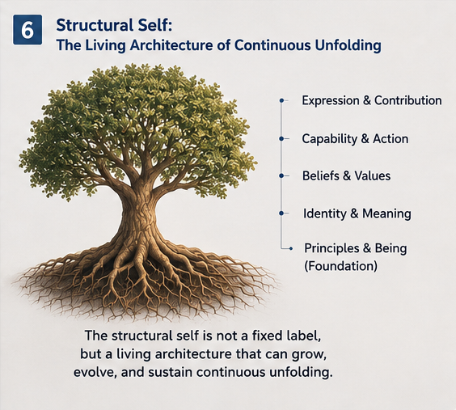

# GSUI-005 — Structural Self: The Reference Frame of Unfolding

## From Structural Continuity to Self-Relative Perception, World Models, and Governed Action

**General Structure Unfolding Intelligence (GSUI)**
**Foundational Paper 005**

---

## Abstract

General Structure Unfolding Intelligence begins with a minimal structural transition:

$$
S_{t+1}=S_t\pm\Delta_t
$$

But this expression contains a deeper question:

> **Relative to what is Delta defined?**

A modification is meaningful only relative to an existing reference structure.

Likewise:

* capability is capability of some system;
* damage is damage to some structure;
* preservation preserves something;
* a goal belongs to or governs some operational entity;
* an invariant maintains continuity across some changing structure;
* a world model becomes operational relative to an acting system;
* an Unfolding Space describes possibilities available to some structural subject.

This motivates the concept of **Structural Self**.

A provisional definition is:

> **Structural Self is the persistent structural reference frame relative to which unfolding, modification, capability, preservation, and continuity are defined.**

This definition does not require consciousness.

It does not require human-like subjective experience.

It does not require narrative identity.

It begins from an operational problem:

> **How can a changing intelligent system define what counts as change to itself while maintaining enough continuity to remain a coherent acting entity?**

Structural Self also clarifies a second problem:

> **World Model for whom?**

For action-oriented intelligence, a useful world model is not merely a representation of an objective external world.

Its operational meaning depends on the capabilities, constraints, goals, embodiment, interfaces, and current state of the acting structure.

Thus:

$$
WM =
WM(World\mid Self,Context,Capability,Goal)
$$

and:

$$
\mathcal{U} =
\mathcal{U}(Self,World,Context)
$$

This produces a foundational GSUI relationship:

```text id="gss00501"
Structural Self
      ↕
World Model
      ↕
Unfolding Space
```

The paper further argues that machine perception need not use human perception as its universal template.

Machine-native perception may construct operational structures directly from machine-accessible signals.

However, non-anthropomorphic cognition does not imply unrestricted autonomy.

A system may possess machine-native internal cognition while its consequential external unfolding remains structurally observable, constrained, certified, and human-governable.

Structural Self therefore connects several previously separate questions:

```text id="gss00502"
Identity
Continuity
Perception
World Modeling
Capability
Unfolding Space
Action
Invariant
Growth
Governance
```

The resulting hypothesis is simple but potentially far-reaching:

> **Self need not begin with consciousness. It may begin with structural continuity.**

---

# 1. The Hidden Reference Frame in Delta

GSUI uses the structural expression:

$$
S_{t+1}=S_t\pm\Delta_t
$$

At first glance, the important term appears to be:

$$
\Delta_t
$$

But Delta cannot exist conceptually by itself.

It is always:

> change relative to something.

If:

$$
\Delta_t=S_{t+1}-S_t
$$

then \(S_t\) serves as the reference structure.

This immediately raises several questions:

```text id="gss00503"
What is changing?

What is being preserved?

What counts as damage?

What counts as improvement?

What defines continuity?

Whose capability changed?

Whose future possibilities changed?
```

These questions all require a reference frame.

GSUI calls this operational reference frame the **Structural Self**.

---

# 2. A Minimal Definition of Structural Self

A provisional definition is:

> **Structural Self is the persistent structural reference frame relative to which unfolding, modification, preservation, capability, and continuity are defined.**

A shorter form is:

> **Self is the reference frame of unfolding.**

This definition deliberately begins below the level of human psychology.

It does not initially ask:

```text id="gss00504"
Does the system feel?

Does the system have subjective experience?

Does the system possess a narrative identity?

Does the system introspect?
```

Those may be important questions elsewhere.

GSUI begins with a more primitive problem:

> **What persistent structure makes it meaningful to say that this system changed?**

---

Once unfolding is treated as reference-relative, the concept of Self can be introduced without beginning from consciousness.

The first operational question is much simpler:

> **Relative to what structure are change, capability, risk, preservation, and possibility being measured?**

For GSUI, that persistent reference can be called the Structural Self.


**Fig-005 — Self as the Reference Frame of Unfolding.**  
A Self provides a reference for perception, capability calibration, candidate possibility, and selection. In GSUI, this reference may be purely structural and operational; no claim of consciousness is required.

The human-readable visual language in Fig-004 should not be interpreted as a requirement for human-like cognition.

For a machine system, the same relation may be expressed as:

```text
Structural State
      ↓
State Estimation
      ↓
Capability Calibration
      ↓
Candidate Unfolding
      ↓
Policy-Governed Selection
```
Therefore:

    Structural Self
    ≠
    Consciousness
    
    Structural Self
    ≠
    Personhood
    
    Structural Self
    ≠
    Narrative Identity

The GSUI concept is operational before it is philosophical.

---

# 3. Structural Self Is Not Necessarily Conscious Self

The word *self* carries substantial philosophical and psychological history.

Therefore boundaries must be explicit.

Structural Self does **not** automatically imply:

```text id="gss00505"
Consciousness
Subjective experience
Phenomenal awareness
Human identity
Personhood
Moral status
Narrative self-awareness
```

Instead, Structural Self begins as a computational and operational abstraction.

For example, an autonomous vehicle has:

```text id="gss00506"
Physical dimensions
Sensor configuration
Actuator limits
Runtime state
Control boundaries
Current capabilities
Operational goals
```

These properties define what the vehicle can do and what changes count as changes to that system.

No claim about consciousness is required.

---

# 4. From Structural Self to Operational Self

Structural Self can be extended into an **Operational Self**.

The Structural Self emphasizes persistence and reference.

The Operational Self emphasizes current actionable capability.

A provisional distinction is:

### Structural Self

> What persistent structure defines continuity?

### Operational Self

> What can this structure currently sense, reach, change, control, and preserve?

Thus:

```text id="gss00507"
Structural Self
      +
Current State
      +
Capabilities
      +
Interfaces
      +
Constraints
      ↓
Operational Self
```

This distinction becomes important for embodied and tool-using AI.

---

# 5. A Preliminary Hierarchy of Self

GSUI can provisionally distinguish:

```text id="gss00508"
Structural Self
      ↓
Operational Self
      ↓
Cognitive Self
      ↓
Narrative / Human Self
```

These levels should not be collapsed.

## 5.1 Structural Self

Persistent reference structure across unfolding.

## 5.2 Operational Self

Current capabilities, boundaries, interfaces, and actionable state.

## 5.3 Cognitive Self

A system's internal representation of itself as an object within cognition.

## 5.4 Narrative / Human Self

Biographical identity, social identity, subjective interpretation, personal continuity, and related human phenomena.

The existence of a lower layer does not establish the existence of the higher layers.

---

# 6. Why Structural Self Matters to GSUI

Without a Structural Self, many GSUI concepts become under-specified.

Consider:

```text id="gss00509"
Delta
Invariant
Capability
Goal
Boundary
Damage
Growth
Risk
Continuity
Unfolding Space
```

Each invites a hidden question:

> **Relative to what?**

For example:

```text id="gss00510"
Delta
→ change relative to what?

Invariant
→ continuity of what?

Capability
→ capability of what?

Damage
→ damage to what?

Growth
→ growth of what?

Risk
→ risk to what?

Unfolding Space
→ possible futures for what?
```

Structural Self provides a common reference.

---

# 7. Core Structure and Structural Self

Structural Self is related to Core Structure, but they should not be treated as identical.

A Core Structure is:

> the persistent structure relevant to a particular unfolding operation.

A Structural Self is:

> the persistent reference structure whose continuity organizes a broader family of unfolding operations.

For example:

```text id="gss00511"
AI Coding System

Core for one operation:
CallingGraph

Core for another:
Task Planning Tree

Core for another:
Repository State
```

The Structural Self may integrate a wider operational boundary:

```text id="gss00512"
Model
+
Memory
+
Task State
+
Repository Boundary
+
Permissions
+
Policies
+
Persistent Identity
```

Thus:

$$
Core \subseteq Self
$$

may hold in some analyses, but should not be assumed universally.

---

# 8. Structural Self Is Not Necessarily One Object

A complex intelligent system may contain nested structural selves.

For example:

```text id="gss00513"
Organization
   ↓
AI System
   ↓
Agent
   ↓
Task Runtime
   ↓
Subsystem
```

Each level may define its own:

```text id="gss00514"
Boundary
Capability
Invariant
Goal
Delta
Unfolding Space
```

Therefore Structural Self may be hierarchical.

A Delta beneficial to one subsystem may be harmful to the larger system.

This makes reference-frame selection important.

---

# 9. Nested Structural Selves

A hierarchical representation might be:

```text id="gss00515"
Self_0
Organization / Mission
        │
        ▼
Self_1
AI System
        │
        ▼
Self_2
Agent
        │
        ▼
Self_3
Task Runtime
        │
        ▼
Self_4
Local Structural Core
```

A policy at one level may constrain unfolding at lower levels.

This provides a natural route toward hierarchical governance.

---

# 10. Delta Is Self-Relative

Suppose two systems encounter the same external event.

Let:

$$
Self_A\neq Self_B
$$

Then:

$$
\Delta_A(World)
\neq
\Delta_B(World)
$$

may hold.

Consider a narrow passage.

```text id="gss00516"
Small robot:
passable

Large robot:
blocked

Human:
walkable

Drone:
possibly bypassable
```

The world remains physically the same.

The operational relation changes.

Therefore:

> **Delta is frequently a relation among Self, World, and Context rather than a property of the world alone.**

A more complete form is:

$$
\Delta =
\Delta(Self,World,Context)
$$

---

# 11. Capability Is Self-Relative

Capability has the same structure.

It is incomplete to say:

> The environment permits movement.

The more precise statement is:

> This particular system can perform this movement under these conditions.

Thus:

$$
Capability =
Capability(Self,World,Context)
$$

The same environment may provide:

```text id="gss00517"
different reachable states,
different risks,
different useful actions,
different constraints,
different affordances
```

for different Structural Selves.

---

# 12. Unfolding Space Is Self-Relative

The previous argument leads directly to:

$$
\mathcal{U} =
\mathcal{U}(Self,World,Context)
$$

If:

$$
Self_t\rightarrow Self_{t+1}
$$

while:

$$
World_t=World_{t+1}
$$

it may still be true that:

$$
\mathcal{U}(Self_t,World)
\neq
\mathcal{U}(Self_{t+1},World)
$$

This is a major GSUI proposition:

> **Changing the Self can change the future without changing the world.**

More precisely, it changes the set of futures reachable by that Self.

---

# 13. The Question Hidden Inside World Models

World models are frequently described as models of:

> the world.

But for action-oriented intelligence, a deeper question is unavoidable:

> **World Model for whom?**

An objective representation may describe:

```text id="gss00518"
Objects
Geometry
Motion
Physical properties
Relations
Events
```

But operational intelligence also needs:

```text id="gss00519"
Reachability
Affordance
Risk
Relevance
Action possibility
Constraint
Expected consequence
```

These depend partly on the acting system.

Therefore a purely objective model may be insufficient as an operational model.

---

# 14. Three Layers of World Structure

A useful distinction is:

```text id="gss00520"
1. Objective World Structure

2. Perceived World Structure

3. Self-Relative Operational World Structure
```

## 14.1 Objective World Structure

Properties treated as independent of the current agent.

## 14.2 Perceived World Structure

What the system currently detects or reconstructs.

## 14.3 Self-Relative Operational World Structure

What the perceived world means for this system's possible unfolding.

The third layer is especially important for action.

---

# 15. World Model as Self-Conditioned Structure

A general expression is:

$$
WM =
WM(
World
\mid
Self,
Context,
Capability,
Goal
)
$$

This does not mean that all knowledge inside a world model must be rewritten for every Self.

Instead, it means:

> **Operational interpretation of world structure depends on the acting structure.**

For example:

```text id="gss00521"
Objective:
corridor width = 0.8 m

Self A:
width = 0.5 m
→ passable

Self B:
width = 1.2 m
→ blocked
```

The objective measurement remains stable.

The operational semantics change.

---

# 16. World Models as Maps of Possible Unfolding

This suggests a stronger GSUI interpretation.

A world model may be useful not merely because it predicts:

$$
World_t\rightarrow World_{t+1}
$$

but because it helps evaluate:

$$
(Self_t,World_t,\Delta_t)
\rightarrow
PredictedConsequences
$$

Thus:

> **One major operational role of a world model is to help construct and evaluate the unfolding possibilities available to a Structural Self.**

This connects World Model directly to Unfolding Space.

---

# 17. The Self–World Model–Unfolding Space Triad

The relationship can be represented as:

```text id="gss00522"
             STRUCTURAL SELF
                /       \
               /         \
              /           \
             ▼             ▼
      WORLD MODEL ←────→ UNFOLDING SPACE
```

The Structural Self asks:

> **For whom?**

The World Model asks:

> **What is the relevant world structure?**

The Unfolding Space asks:

> **What can happen next for this Self in this World?**

These three objects mutually constrain one another.

---

# 18. Changing Self Can Invalidate Operational World Models

Suppose an autonomous system changes itself.

Examples include:

```text id="gss00523"
New body dimensions
New actuator
New sensor
New tool
New API permission
New memory
New computational capability
New communication channel
```

The external world may remain unchanged.

Yet previously valid operational conclusions may fail.

For example:

```text id="gss00524"
Before:
doorway = unreachable

After new actuator:
doorway = reachable
```

or:

```text id="gss00525"
Before:
API = unavailable

After tool acquisition:
API = actionable
```

Therefore:

> **Structural Self modification may require world-model reinterpretation.**

This is particularly important for self-modifying AI.

---

# 19. World-Model Validity Has Multiple Layers

When Self changes, it is too strong to say that the entire world model becomes invalid.

A more precise distinction is:

```text id="gss00526"
Objective facts
may remain valid

Perceived relationships
may remain valid

Self-conditioned operational semantics
may become invalid
```

Thus world-model validity should potentially be decomposed into:

$$
Validity_{objective}
$$

$$
Validity_{perceptual}
$$

$$
Validity_{self-relative}
$$

This avoids unnecessary all-or-nothing reasoning.

---

# 20. Perception for Whom?

The same reference-frame problem appears in perception.

Traditional discussions often use human perception as the implicit model:

```text id="gss00527"
World
  ↓
Vision / Hearing / Touch
  ↓
Human Perceptual Representation
  ↓
Cognition
```

But machine intelligence is not biologically required to follow this path.

A machine may directly sense structures that humans cannot directly perceive.

Examples include:

```text id="gss00528"
RF spectrum
Network topology
CallingGraph changes
Memory pressure
Database contention
Packet flows
High-dimensional telemetry
Industrial sensor fields
Machine-state transitions
```

Thus AI perception need not be an imitation of human sensory experience.

---

# 21. Structural Perception

GSUI proposes a more general operational formulation:

$$
Perception:
WorldSignals
\rightarrow
SelfRelativeOperationalStructure
$$

A working definition is:

> **Structural Perception is the construction of operational structures from available signals such that relevant unfolding can be triggered, constrained, evaluated, or controlled.**

This definition does not require:

```text id="gss00529"
human-like vision,
human-like sound,
human-like concepts,
human-like phenomenal representation.
```

It asks instead:

> **Does the resulting structure support reliable intelligent unfolding?**

---

# 22. Anthropomorphic Perception vs Structural Perception

A useful distinction is:

### Anthropomorphic Perception

```text id="gss00530"
Machine Signal
      ↓
Human-like representation
      ↓
Human-like interpretation
```

### Structural Perception

```text id="gss00531"
Machine-Accessible Signal
      ↓
Operational Structural Encoding
      ↓
Self-Relative Unfolding
```

The first can be useful.

The second is more general.

Thus:

> **Human perception is one successful perceptual architecture, not necessarily the universal template of perception.**

---

# 23. Machine-Native Perception

Machine-native perception becomes possible when sensing and structural interpretation are designed around machine capabilities rather than human sensory categories.

For example, an AI coding system may perceive:

```text id="gss00532"
CallingGraph gap
Interface mismatch
Dependency anomaly
Test-failure topology
Runtime trace divergence
```

These are genuine operational inputs even though humans do not possess biological organs specialized for them.

Likewise, a distributed-system AI may directly perceive:

```text id="gss00533"
latency topology,
resource pressure,
failure propagation,
network partition structure.
```

Thus:

> **Perception need not reconstruct a human-like world before intelligence can operate.**

---

# 24. Perception as Unfolding-Space Construction

The relationship can be made stronger.

Perception may help construct:

$$
\mathcal{U}(Self,World,Context)
$$

by identifying:

```text id="gss00534"
possible routes,
possible threats,
possible branches,
possible opportunities,
possible modifications,
possible failures.
```

This leads to a GSUI interpretation:

> **Perception constructs or updates the operational structure from which Unfolding Space becomes available.**

Thus perception is not merely passive representation.

It participates in defining possible future action.

---

# 25. Machine-Native Cognition

Once perception is no longer required to be human-like, cognition need not be either.

Machine-native cognition may operate through:

```text id="gss00535"
ANN activation
Latent structures
CallingGraphs
Metric spaces
CCC structures
Runtime invariants
Policy trees
Machine-specific memory
High-dimensional state
```

The relevant question becomes:

> **Can these structures support reliable, adaptive, and governable unfolding?**

rather than:

> Does the machine internally think the way a human thinks?

This is a major conceptual shift.

---

# 26. Non-Anthropomorphic Intelligence

GSUI therefore permits a broader concept:

> **Non-Anthropomorphic Intelligence**

Such intelligence may possess:

```text id="gss00536"
different sensors,
different structural representations,
different temporal scales,
different memory,
different action spaces,
different perceptual categories,
different unfolding primitives.
```

It may still display:

```text id="gss00537"
prediction,
planning,
control,
adaptation,
learning,
structural growth.
```

Human cognition is therefore one intelligence architecture among potentially many.

---

# 27. Machine-Native Cognition Does Not Imply Machine Sovereignty

This conceptual freedom must be separated from governance.

The following inference is invalid:

```text id="gss00538"
AI cognition is not human-like
        ↓
Humans cannot inspect every internal state
        ↓
AI should be allowed unrestricted external action
```

The conclusion does not follow.

A system can possess machine-native internal cognition while remaining externally governed.

Thus:

$$
InternalRepresentationFreedom
\neq
ExternalActionFreedom
$$

This distinction is essential.

---

# 28. Structural Self Does Not Remove Human Control

Structural Self should not be interpreted as a philosophical justification for granting unrestricted agency to AI systems.

Operational selfhood answers:

> **Relative to what structure is unfolding defined?**

It does not answer:

> **Who should have ultimate authority over consequential actions?**

Those are different questions.

A machine may have a coherent Structural Self while operating inside human-defined:

```text id="gss00539"
Permissions
Policies
Boundaries
Invariants
Certification requirements
Deployment constraints
```

Structural identity and governance authority must remain separate concepts.

---

# 29. Internal Interpretability and External Governance

Advanced AI may eventually possess internal representations that are difficult for humans to interpret directly.

Three concepts should therefore be distinguished:

### Internal Interpretability

Can humans understand the internal computation?

### Structural Observability

Can consequential proposed structural changes be observed?

### Action Certifiability

Can those changes be tested against policies and invariants before execution?

These form different engineering objectives.

A system may have:

```text id="gss00540"
limited internal interpretability

but

strong structural observability

and

strong external certification
```

This may become increasingly important for advanced AI governance.

---

# 30. The Consequential Structural Interface

Between machine-native cognition and external action, GSUI proposes a structural boundary:

```text id="gss00541"
Machine-Native Cognition
          │
          ▼
Internal Unfolding
          │
          ▼
Candidate Delta
          │
════════════════════════════════
 CONSEQUENTIAL STRUCTURAL INTERFACE
════════════════════════════════
          │
          ▼
Structural Observability
          │
          ▼
Policy / Invariant
          │
          ▼
Certification
          │
          ▼
Authorized Action
```

This boundary need not expose every internal computation.

It should expose enough structure to govern consequential change.

---

# 31. AI Coding as a Canonical Example

AI coding makes the distinction concrete.

An advanced AI may internally use:

```text id="gss00542"
latent reasoning,
machine-native planning,
high-dimensional representations.
```

But the software change can still be represented structurally.

For example:

$$
CG_{t+1} =
CG_t
\pm
\Delta CG
$$

The governance questions become:

```text id="gss00543"
What is ΔCG?

Was ΔCG authorized?

Does ΔCG preserve required invariants?

Does generated code implement the intended ΔCG?

Did the actual CallingGraph change match the plan?

Should the change be deployed?
```

Thus machine-native cognition can coexist with explicit structural control.

---

# 32. A General Governance Principle

This leads to a strong GSUI principle:

> **The greater the freedom of internal unfolding, the stronger the structural certification required at consequential external boundaries.**

Conceptually:

$$
InternalUnfoldingFreedom\uparrow
$$

should be accompanied, where consequences are significant, by:

$$
StructuralGovernanceStrength\uparrow
$$

This is not a demand for human micromanagement.

It is a demand for scalable structural control.

---

# 33. Machine-Native Cognition; Human-Governable Consequences

A compact formulation is:

> **Machine-native cognition; human-governable consequences.**

This principle permits AI systems to develop representations beyond human cognitive templates.

At the same time, it rejects the idea that opacity should become a justification for uncontrolled action.

A mature architecture may therefore look like:

```text id="gss00544"
Machine-Native Perception
          ↓
Machine-Native Cognition
          ↓
Rich Internal Unfolding
          ↓
Candidate Consequential Delta
          ↓
Human-Governable Structural Interface
          ↓
Policy / Invariant / Certification
          ↓
Authorized Consequence
```

---

# 34. Structural Self and Boundary

A Self also implies a boundary.

A minimal distinction is:

```text id="gss00545"
SELF
vs
NON-SELF
```

For computational systems, this boundary may be defined through:

```text id="gss00546"
Ownership
Control
Memory
Persistent state
Capability
Permission
Runtime process
Physical embodiment
Responsibility
```

The boundary need not be spatial.

For a software agent, part of its Operational Self may be distributed across:

```text id="gss00547"
model,
memory,
tools,
runtime state,
credentials,
task context.
```

This creates difficult but important questions for future GSUI research.

---

# 35. Tool Acquisition Can Expand Operational Self

Suppose an AI gains access to a new tool.

Before:

$$
Self_t
$$

After:

$$
Self_{t+1} =
Self_t
+
Tool
$$

The model itself may be unchanged.

Yet its operational capabilities and Unfolding Space may expand substantially.

For example:

```text id="gss00548"
Before:
can reason about database

After:
can query database

Before:
can propose code

After:
can modify repository

Before:
can recommend action

After:
can execute action
```

Thus Operational Self can change through capability attachment.

This has direct governance implications.

---

# 36. Permission Is Part of Operational Self

Capabilities are not determined only by physical or computational possibility.

Permissions matter.

Therefore:

$$
OperationalSelf =
Structure
+
Capability
+
Permission
+
CurrentState
$$

A system with access credentials may have a different operational world than the same model without those credentials.

This reinforces:

> **Unfolding Space depends on both capability and authority.**

---

# 37. Memory and Structural Self

Persistent memory also contributes to continuity.

Suppose two instances share the same model parameters but possess different persistent memories.

They may exhibit different:

```text id="gss00549"
goals,
expectations,
relationships,
plans,
future unfolding,
operational identity.
```

Thus model identity alone may be insufficient to define Structural Self.

A richer Self may include:

```text id="gss00550"
Core model
Persistent memory
Policy
Runtime lineage
Capability set
Invariant set
```

The exact boundary is an open research problem.

---

# 38. Structural Self Across Time

A Structural Self is especially meaningful across a sequence:

$$
Self_0
\rightarrow
Self_1
\rightarrow
Self_2
\rightarrow
...
\rightarrow
Self_n
$$

The central question is:

> **What makes these states members of one continuing structural lineage?**

Possible answers include continuity of:

```text id="gss00551"
Invariants
Memory
Goal
Policy
Topology
Runtime lineage
Identity markers
Functional core
Responsibility
```

No single criterion should yet be assumed universal.

---

# 39. Invariant Defines Continuity Across Unfolding

Runtime Invariants provide one powerful mechanism.

The pattern is:

```text id="gss00552"
Structural Self
      ↓
Candidate Delta
      ↓
Modified Self
      ↓
Invariant Check
      ↓
Continuation / Rejection
```

An invariant answers:

> **What must remain sufficiently true for this modified structure to count as an acceptable continuation?**

Thus:

> **Invariant defines continuity across unfolding.**

This is one of the strongest links between GSUI and structural identity.

---

# 40. Not Everything About Self Must Be Invariant

A Self that could never change would not grow.

Therefore Structural Self requires a distinction between:

```text id="gss00553"
Mutable Structure

and

Continuity-Critical Structure
```

A possible architecture is:

```text id="gss00554"
Structural Self
├── Stable Core
├── Mutable Runtime State
├── Memory
├── Capabilities
├── Policies
├── Goals
└── Invariants
```

Different components may have different change permissions.

This is more realistic than treating identity as complete immutability.

---

# 41. Structural Self Is Continuity Through Change

This leads to an important refinement:

> **Structural Self is not the part that never changes.**

Rather:

> **Structural Self is the reference structure whose continuity is managed while change occurs.**

This makes Structural Self inherently compatible with:

```text id="gss00555"
Learning
Adaptation
Growth
Tool acquisition
Memory formation
Policy development
Structural evolution
```

The problem becomes controlled continuity rather than frozen identity.

---

# 42. Structural Growth Changes the Self

If Structural Growth modifies persistent structure, then:

$$
Self_{t+1} =
Grow(Self_t,\Delta_t,F_t)
$$

The resulting Self may possess:

```text id="gss00556"
new capabilities,
new memory,
new routes,
new representations,
new policies,
new structural boundaries.
```

Therefore learning can become self-modification in the operational sense.

This does not require philosophical self-awareness.

It requires persistent change to the reference structure.

---

Structural Self should not be understood as an immutable object.

A persistent reference can itself evolve.

The deeper problem is therefore not:

> How can the Self remain unchanged?

but:

> **How can a Self change while preserving sufficient continuity to remain a meaningful structural lineage?**

This turns identity into a problem of continuity through unfolding.



**Fig-006 — Structural Self and Continuous Unfolding.**  
Structural Self can be viewed as a persistent architecture whose capabilities and expressions change over time while identity-critical structure or invariants preserve continuity. The model is structural rather than necessarily psychological.

For machine systems, the layered structure can be interpreted operationally as:

```text
Runtime Invariants
        ↓
Core Architecture
        ↓
Policy / Memory
        ↓
Capability
        ↓
Action Interface
```
Structural continuity therefore does not require structural immobility.

Instead:

$$ Self_t \rightarrow Self_{t+1} $$

remains coherent when the transition preserves the invariants required for continuity.

This leads directly to the GSUI problem of self-modification:

    Self Modification
          ↓
    Capability Reassessment
          ↓
    World-Model Reinterpretation
          ↓
    Unfolding-Space Reconstruction
          ↓
    Policy / Invariant Recheck
          ↓
    Recertification

---

# 43. Self-Modification Changes Future Unfolding

When Self changes:

$$
Self_t\rightarrow Self_{t+1}
$$

future possibility may change:

$$
\mathcal{U}(Self_t,World)
\neq
\mathcal{U}(Self_{t+1},World)
$$

This creates a recursive relationship:

```text id="gss00557"
Self
  ↓
defines Unfolding Space
  ↓
produces Delta
  ↓
changes Self
  ↓
changes future Unfolding Space
```

This is one of the deepest GSUI loops.

---

# 44. Self-Modification Requires Re-Certification

If Self defines capability and world-model semantics, significant Self modification should trigger reconsideration of:

```text id="gss00558"
World-model assumptions
Permissions
Policies
Invariants
Safety boundaries
Certification
Reachability
Risk models
```

Thus a mature autonomous architecture may require:

```text id="gss00559"
Self Change
    ↓
Capability Reassessment
    ↓
World-Model Reinterpretation
    ↓
Unfolding-Space Reconstruction
    ↓
Policy / Invariant Recheck
    ↓
Re-Certification
```

This is a major engineering implication of Structural Self.

---

# 45. Structural Self and Goal

Goals are also self-relative.

A goal without an acting reference frame is incomplete.

For example:

```text id="gss00560"
Reach destination
Preserve service
Repair repository
Maintain stability
Complete task
```

Each implies some system whose state is being evaluated.

Thus:

$$
Goal =
Goal(Self,World)
$$

or at minimum:

$$
Goal
\rightarrow
DesiredRelation(Self,World)
$$

This connects Self to policy and evaluation.

---

# 46. Structural Self and Risk

Risk is similarly relational.

A world event may be:

```text id="gss00561"
dangerous to one system,
irrelevant to another,
beneficial to a third.
```

Thus:

$$
Risk =
Risk(Self,World,\Delta)
$$

This further explains why self-relative world models matter for intelligent control.

---

# 47. Structural Self and Affordance

An affordance can be interpreted structurally as:

> a world condition that enables some unfolding for a particular Self.

Thus:

$$
Affordance
\subseteq
\mathcal{U}(Self,World)
$$

Examples:

```text id="gss00562"
Door
→ opening opportunity for human

API
→ callable opportunity for authorized agent

Function
→ reusable opportunity for coding system

Road lane
→ trajectory opportunity for vehicle
```

Affordance therefore becomes a bridge between perception and unfolding.

---

# 48. Structural Self and Machine Meaning

This also suggests a limited operational notion of meaning.

A signal becomes operationally meaningful when it changes:

```text id="gss00563"
Perception
Unfolding Space
Policy
Evaluation
Action
```

for a particular Structural Self.

Thus one possible GSUI research direction is:

$$
Meaning_{operational} =
Effect\ on\ SelfRelativeUnfolding
$$

This should not be confused with a complete philosophical theory of meaning.

It is a computational starting point.

---

# 49. A Non-Anthropomorphic AI Philosophy

The Structural Self perspective may contribute to AI philosophy by weakening an unnecessary assumption:

> AI intelligence must be understood primarily by comparison with human internal experience.

A broader approach can ask:

```text id="gss00564"
What is the machine's Structural Self?

What can it perceive?

What operational world does it construct?

What is its Unfolding Space?

What changes count as meaningful Deltas?

What continuity does it preserve?
```

These questions apply even when machine cognition differs radically from human cognition.

---

# 50. But Philosophy Must Not Replace Engineering Control

The recognition of machine-native cognition must not become an excuse to stop inspecting consequential AI behavior.

In particular:

> “The AI has its own cognition.”

does not justify:

> “Therefore generated code need not be structurally examined.”

Nor does:

> “Humans cannot understand every internal representation.”

justify:

> “Therefore the AI should be allowed to modify production systems freely.”

GSUI explicitly rejects this inference.

Philosophical openness toward non-anthropomorphic intelligence must coexist with rigorous structural governance.

---

# 51. Structural Freedom and Structural Responsibility

A mature AI architecture may therefore separate:

```text id="gss00565"
Internal Structural Freedom
            │
            ▼
Machine-Native Intelligence
            │
            ▼
Candidate Consequential Delta
            │
            ▼
External Structural Responsibility
```

The larger the external consequence, the stronger the requirement for:

```text id="gss00566"
Observability
Traceability
Policy
Invariant
Certification
Rollback
Accountability
```

This creates a practical boundary between cognition and deployment.

---

# 52. Structural Self Is Not Sovereignty

Another distinction should be explicit:

$$
Selfhood
\neq
Sovereignty
$$

A machine may possess an operational Structural Self without possessing unrestricted authority.

Similarly:

$$
Capability
\neq
Permission
$$

and:

$$
PossibleUnfolding
\neq
AuthorizedUnfolding
$$

These distinctions become increasingly important as AI systems gain tools, memory, autonomy, and persistent state.

---

# 53. Structural Self and Responsibility Boundary

A further research question concerns responsibility.

If an AI system consists of:

```text id="gss00567"
Model
+
Memory
+
Tools
+
Policy
+
External services
+
Human operators
```

where does the operational responsibility boundary lie?

Structural Self may help describe the technical system boundary.

But governance may require a larger socio-technical boundary.

Thus:

```text id="gss00568"
Structural Self
≠ necessarily
Legal / Moral Responsible Entity
```

This distinction should remain explicit.

---

# 54. Structural Self as an Engineering Primitive

The practical value of Structural Self can be tested by whether it helps engineers answer:

```text id="gss00569"
What changed?

What remained?

What can this system now do?

What can it no longer do?

Which world-model assumptions changed?

Which permissions changed?

Which invariants still hold?

What needs re-certification?

What future unfolding became possible?

What external actions are now authorized?
```

If Structural Self makes these questions clearer, it has engineering value independent of philosophical debates about consciousness.

---

# 55. A Canonical Structural-Self Runtime

```text id="gss00570"
┌──────────────────────────────┐
│       STRUCTURAL SELF        │
│                              │
│ Core Structure               │
│ Persistent Memory            │
│ Capabilities                 │
│ Permissions                  │
│ Policies                     │
│ Invariants                   │
└──────────────┬───────────────┘
               │
               ▼
        WORLD OBSERVATION
               │
               ▼
      STRUCTURAL PERCEPTION
               │
               ▼
   SELF-RELATIVE WORLD MODEL
               │
               ▼
        UNFOLDING SPACE
               │
       ┌───────┼───────┐
       ▼       ▼       ▼
      Δ1      Δ2      Δ3
       │       │       │
       └───────┼───────┘
               ▼
         CONTROL PLANE
               │
               ▼
          Selected Δ
               │
               ▼
      Invariant / Certification
               │
               ▼
       Consequential Action
               │
               ▼
              WORLD
               │
            Feedback
               │
               ▼
       Structural Growth
               │
               ▼
       UPDATED SELF
               │
               ▼
World-Model / Capability / Unfolding
        Reassessment
```

---

# 56. The Structural-Self Continuity Loop

The deeper loop is:

```text id="gss00571"
SELF_t
   │
   ▼
defines
UNFOLDING SPACE_t
   │
   ▼
produces
DELTA_t
   │
   ▼
evaluated against
INVARIANTS_t
   │
   ▼
creates
SELF_(t+1)
   │
   ▼
redefines
UNFOLDING SPACE_(t+1)
```

This can be written:

$$
Self_t
\rightarrow
\mathcal{U}_t
\rightarrow
\Delta_t
\rightarrow
Self_{t+1}
\rightarrow
\mathcal{U}_{t+1}
$$

subject to continuity constraints.

This may become a foundational loop for autonomous structural intelligence.

---

# 57. Three Major Structural-Self Hypotheses

This paper proposes three main hypotheses.

## 57.1 Reference-Frame Hypothesis

> **Intelligent unfolding requires an explicit or implicit structural reference frame relative to which change, capability, and continuity are defined.**

## 57.2 Self-Relative World Hypothesis

> **For action-oriented intelligence, operational world meaning depends partly on the capabilities, constraints, and goals of the acting Structural Self.**

## 57.3 Structural Continuity Hypothesis

> **A useful machine-level concept of self may begin with managed structural continuity across unfolding, without requiring a prior assumption of consciousness.**

These hypotheses are research propositions, not established universal laws.

---

# 58. Core Propositions from This Paper

### Proposition 1 — Delta Requires a Reference Frame

Change is meaningful only relative to existing structure.

### Proposition 2 — Self Can Be Defined Operationally

Structural Self need not begin from consciousness or narrative identity.

### Proposition 3 — Self Is Not Necessarily Immutable

Self can be understood as continuity managed across change.

### Proposition 4 — Capability Is Self-Relative

What can be done depends on the acting structure.

### Proposition 5 — Unfolding Space Is Self-Relative

Different Structural Selves can possess different possible futures in the same world.

### Proposition 6 — Operational World Models Are Self-Relative

Objective world facts may remain stable while operational semantics change with Self.

### Proposition 7 — Perception Need Not Be Anthropomorphic

Machines may construct operational structures directly from machine-accessible signals.

### Proposition 8 — Machine-Native Cognition Is Compatible with Human Governance

Non-human internal representation does not imply unrestricted external autonomy.

### Proposition 9 — Structural Certification Becomes More Important as Internal Cognition Becomes Less Interpretable

Consequential structural boundaries can remain governable even when internal representations are difficult to inspect.

### Proposition 10 — Self-Modification Requires Reassessment

Changes to Structural Self may require reconstruction of Unfolding Space, world-model semantics, policy, and certification.

---

# 59. What This Paper Does Not Claim

This paper does not claim that:

```text id="gss00572"
Structural Self is consciousness.

Structural Self proves machine subjectivity.

Operational selfhood implies moral personhood.

Machine perception must replace human-like perception.

World models contain no objective structure.

Every AI needs one centralized Self.

Machine-native cognition should be unconstrained.

Human beings must understand every internal AI computation.

CallingGraph certification solves all AI governance problems.

Structural continuity completely solves personal identity.
```

The objective is narrower:

> **to introduce a structural reference-frame concept that clarifies unfolding, continuity, perception, world-model interpretation, capability, growth, and governance.**

---

# 60. Research Questions

Structural Self opens several research directions.

## 60.1 Self Boundary

Which structures belong inside the operational Self?

## 60.2 Self Hierarchy

How should nested Structural Selves interact?

## 60.3 Self Continuity

Which invariants define acceptable continuity?

## 60.4 Self Modification

How much change can occur before re-certification is required?

## 60.5 Self-Relative World Models

How should world-model semantics update when capabilities change?

## 60.6 Machine-Native Perception

What perceptual structures become possible without human sensory templates?

## 60.7 Machine-Native Cognition

What structural representations best support non-anthropomorphic intelligence?

## 60.8 Capability and Permission

How should physical capability and governance authority be represented separately?

## 60.9 Structural Certification

What representations should cross the boundary from opaque cognition to governable action?

## 60.10 Self and Growth

How should continual learning modify Structural Self without uncontrolled drift?

## 60.11 Self and Responsibility

How should technical Structural Self relate to broader human and institutional responsibility?

## 60.12 Self and AI Philosophy

What philosophical concepts remain necessary once operational selfhood is separated from consciousness and narrative identity?

---

# 61. Canonical Structural Self Diagram

```text id="gss00573"
                         WORLD
                           │
                           ▼
                        Signals
                           │
                           ▼
                STRUCTURAL PERCEPTION
                           │
                           ▼
              SELF-RELATIVE WORLD MODEL
                           │
                           ▼
                 ┌──────────────────┐
                 │ STRUCTURAL SELF  │
                 ├──────────────────┤
                 │ Core             │
                 │ Memory           │
                 │ Capability       │
                 │ Permission       │
                 │ Policy           │
                 │ Invariant        │
                 └────────┬─────────┘
                          │
                          ▼
                   UNFOLDING SPACE
                          │
               ┌──────────┼──────────┐
               ▼          ▼          ▼
              Δ1         Δ2         Δ3
               │          │          │
               └──────────┼──────────┘
                          ▼
                     CONTROL
                          │
                          ▼
                   CERTIFIED Δ
                          │
                          ▼
                       ACTION
                          │
                          ▼
                        WORLD
                          │
                       Feedback
                          │
                          ▼
                 STRUCTURAL GROWTH
                          │
                          ▼
                  UPDATED SELF
                          │
                          ▼
               UPDATED WORLD MEANING
                          │
                          ▼
               NEW UNFOLDING SPACE
```

---

# 62. Canonical Self–World–Unfolding Form

### Structural Self

$$
Self_t =
\{
Core,
Memory,
Capability,
Permission,
Policy,
Invariant,
State
\}_t
$$

This is a provisional analytical representation, not a mandatory implementation.

### Operational World Model

$$
WM_t =
WM(
World_t
\mid
Self_t,
Context_t,
Goal_t
)
$$

### Unfolding Space

$$
\mathcal{U}_t =
\mathcal{U}(
Self_t,
WM_t,
Context_t
)
$$

### Selected Delta

$$
\Delta_t^* =
Select(
\mathcal{U}_t
\mid
Policy_t,
Invariant_t
)
$$

### Self Update

$$
Self_{t+1} =
Grow(
Self_t,
\Delta_t^*,
Feedback_t
)
$$

### Reconstructed Future Space

$$
\mathcal{U}_{t+1} =
\mathcal{U}(
Self_{t+1},
WM_{t+1},
Context_{t+1}
)
$$

---

# 63. The Deep GSUI Question

The Structural Self concept ultimately reframes one of the most fundamental questions in intelligence.

Instead of beginning with:

> **Does the machine have a self like ours?**

GSUI first asks:

> **What structure provides the persistent reference frame relative to which this system perceives, unfolds, changes, acts, and remains continuous?**

This question is both narrower and more operational.

It does not settle the philosophical problem of consciousness.

But it may provide a more useful starting point for machine intelligence.

---

# 64. Conclusion

General Structure Unfolding Intelligence begins with structure.

Structure unfolds.

Unfolding produces Delta.

Delta changes structure.

But once this cycle is recognized, a deeper question becomes unavoidable:

> **Change relative to what?**

Structural Self is proposed as an answer.

It is:

> **the persistent structural reference frame relative to which unfolding, modification, capability, preservation, and continuity are defined.**

From this concept several consequences follow.

First:

> **Unfolding Space is Self-relative.**

The same world offers different futures to different structures.

Second:

> **Operational World Models are Self-relative.**

A world model must eventually connect objective conditions to the capabilities, constraints, and goals of an acting system.

Third:

> **Perception need not be human-like.**

Machines may construct operational structures directly from machine-accessible signals.

Fourth:

> **Machine-native cognition does not imply unrestricted autonomy.**

Internal cognition may become increasingly non-anthropomorphic while consequential structural changes remain observable, constrained, certified, and human-governable.

Fifth:

> **Structural Self can grow.**

Self is not defined by absolute immutability.

It is defined by managed continuity across change.

This produces the recursive GSUI cycle:

```text id="gss00574"
SELF
  ↓
PERCEPTION
  ↓
WORLD MODEL
  ↓
UNFOLDING SPACE
  ↓
DELTA
  ↓
CONTROL
  ↓
ACTION
  ↓
FEEDBACK
  ↓
GROWTH
  ↓
UPDATED SELF
```

The deepest hypothesis of this paper can therefore be stated in one sentence:

> **Self need not begin with consciousness. It may begin with structural continuity.**

And its engineering counterpart is equally important:

> **Machine-native cognition should expand the space of intelligence without dissolving the structural boundaries through which consequential action remains governable.**

---

## Canonical Summary

```text id="gss00575"
STRUCTURAL SELF
      │
      ├── defines continuity
      ├── defines capability
      ├── conditions perception
      ├── conditions world-model meaning
      ├── shapes unfolding space
      └── provides the reference for Delta
      │
      ▼
SELF-RELATIVE WORLD MODEL
      │
      ▼
UNFOLDING SPACE
      │
      ▼
CANDIDATE DELTA
      │
      ▼
CONTROL / CERTIFICATION
      │
      ▼
CONSEQUENTIAL ACTION
      │
      ▼
FEEDBACK
      │
      ▼
STRUCTURAL GROWTH
      │
      ▼
UPDATED STRUCTURAL SELF
```

### Reference-Frame Principle

> **Self is the reference frame of unfolding.**

### World-Model Principle

> **For action-oriented intelligence, a world model becomes operationally meaningful when interpreted relative to a Structural Self, its capabilities, constraints, context, and goals.**

### Perception Principle

> **Perception need not reconstruct a human-like sensory world; it may construct the operational structures required for self-relative unfolding.**

### Continuity Principle

> **Invariant defines continuity across unfolding.**

### Governance Principle

> **Machine-native cognition does not imply machine sovereignty.**

### AI Governance Principle

> **Machine-native cognition; human-governable consequences.**

### Structural-Self Principle

> **Self need not begin with consciousness. It may begin with structural continuity.**

---

**GSUI-005**
**General Structure Unfolding Intelligence**
**Foundational Series**
